# 모바일 방역로봇

## 기획 배경 및 프로젝트 소개

> 코로나(COVID-19)의 영향으로 **방역**에 대한 관심과 필요성이 증가  
> **옴니휠과 6축 로봇팔**을 활용해 자유롭게 움직이며 **UV 살균**을 하는 프로젝트 

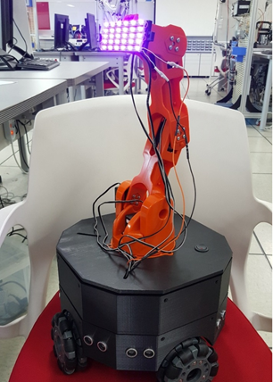 

## 프로젝트 일정

| 일정 | 업무 |
|------|------|
| **09.W3** | 부품 조사 및 구매 / 몸체 설계 (SolidWorks) / 로봇팔 제어 (Arduino & Processing) |
| **09.W4** | 몸체 3D 프린터 출력 (Ultimaker Cura) |
| **10.W1** | 조립 및 결선 / 전원 테스트 / 기능 테스트 |
| **10.W2** | 제어용 어플리케이션 제작 (App Inventor) |
| **10.W3** | 블루투스, 모터, 초음파 기능 구현 (Arduino) |
| **10.W4** | 테스트 및 디버깅 |

## 시스템 구성도 및 개발 환경

- Products Used : Tinkerkit Braccio Robot (T050000), Arduino Mega 2560, UV-a 405nm LED(5V), NEX-14049 100mm Omni Wheel, JGA25-370 DC Gear Motor, L298N Motor Driver, HC-SR04, HC-06
- Programming Tool : SolidWorks, Ultimaker Cura, Arduino IDE, Processing, App Inventor

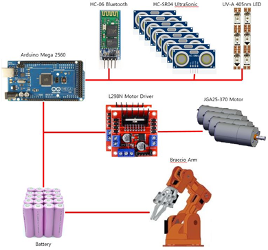 

## 핵심 기술

### SolidWorks와 Ultimaker Cura를 이용해 차체 설계 및 출력

  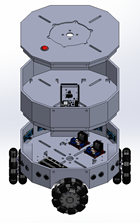
  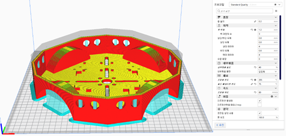

### 좌표를 이용한 로봇팔 제어

- 원하는 좌표로 로봇팔을 움직이기 위해 각 축의 각도 계산

  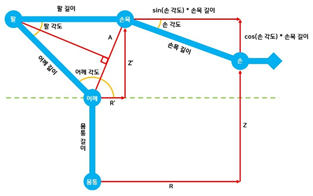
  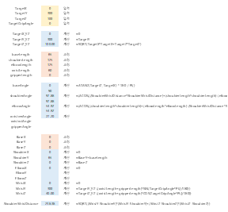

### 프로세싱을 이용해 시리얼 통신으로 로봇팔 제어

- 왼쪽의 시작 화면에서 "X = 0, Y = 300, Z = 100, Angle = 0"을 입력하면 각 축의 각도가 계산되고 시리얼 통신으로 제어

  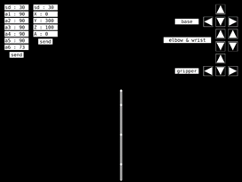
  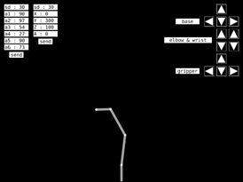
  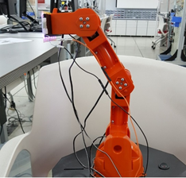

### App Inventor를 이용해 블루투스로 이동 및 로봇팔 제어

  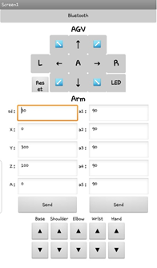
  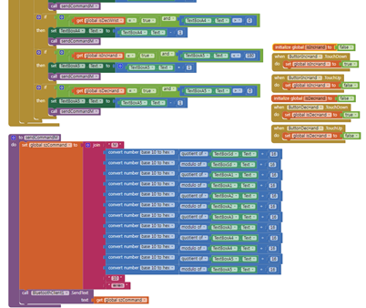

## 프로젝트 보완점과 추후 발전 가능성

### 보완점

- 첫 설계 작업이라 미처 고려하지 못하고 지나친 부분이 많았음
- 모터와 전원 문제로 부품 수정

### 발전 가능성

- 충돌 방지에 초음파 센서를 활용하고 있는데, 라이다 센서로 교체하여 주변 매핑 및 자율 이동 적용
- 배터리를 교체하여 안정적인 환경에서 모터 구동
- 상단 덮개를 교체하여 서빙 로봇 등 다른 용도로 사용할 수 있도록 부품 추가 제작
